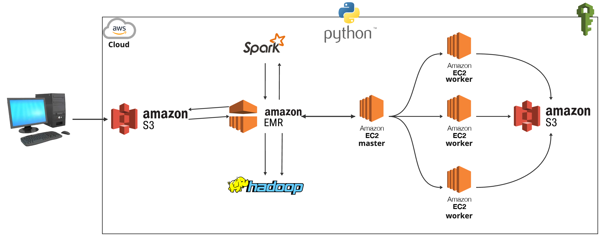

# AWS EMR Data Processing with Apache Spark

## Overview
This project demonstrates how to use Amazon Elastic MapReduce (EMR) for processing large datasets with Apache Spark. It includes:
- A Spark script for ETL (Extract, Transform, Load) operations.
- AWS CLI instructions for setting up and managing an EMR cluster.
- A sample dataset for testing the ETL process.

## System Architecture


## Project Structure
- `spark-etl.py`: Spark script for performing ETL tasks.
- `commands.py`: AWS CLI commands for EMR cluster setup and management.
- `data/`: Sample dataset for the ETL process.

## Spark Script: `spark-etl.py`
This Python script uses Apache Spark to:
- Read data from an input directory.
- Add a timestamp to the data.
- Write the transformed data to an output directory in **Parquet** format.

### Running the Script
To execute the script, use:
```bash
spark-submit spark-etl.py [s3-input-folder] [s3-output-folder]
```
- Replace `[s3-input-folder]` with the path to your input data.
- Replace `[s3-output-folder]` with the path to the output location.

## AWS Commands: `commands.py`
This file contains AWS CLI commands for:
- Setting up and managing an EMR cluster.
- Configuring services required for Spark.
- Submitting Spark jobs to the cluster.

## Data
The `data/` directory contains the dataset used for testing. You can replace it with your own data for practical use.

## Prerequisites
- **Apache Spark**
- **AWS CLI**
- An AWS account with permissions to create and manage EMR clusters.
# AWS-EMR-Data-Processing-with-Apache-Spark

